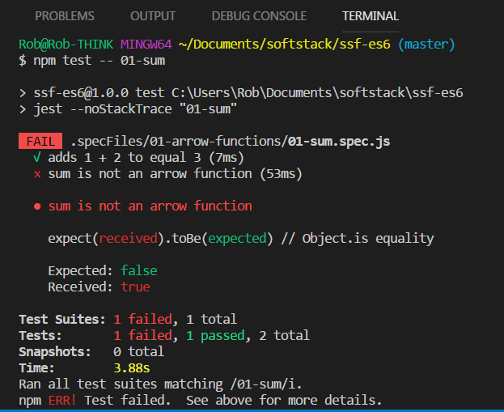
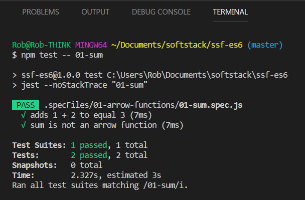

# Typescript Classes Challenge
In this challenge you will create typescript classes with properties and methods as well as create instances of your classes


#### Prequisite (Environment setup)

First we must install typescript. In your terminal run the following command
```
 $ npm install -g typescript
```
** Now ** Clone the repo with the below command

```
$ git clone https://github.com/SoftStackFactory/ssf-classes.git
```


#### Using typescipt and running your code

Before running or testing our typescript code we must first transpile/compile it with the following command:
```
$ tsc <filename>.ts
```

This will conver your code into javascript and create a javascript file with the same name.
To run your javascript file use the following code:

```
$ node <filename>.js
```

to run tests use the following code
```
$ npm test -- <file-name>
```

Once you run the tests you will see a message in your console indicating whether the tests passed or failed

| **failed test(s)**  | **passed test(s)** |
| ------------- | ------------- |
|  |   |
|If you fail to pass a tests read the message in red. The problem will be in the challange file | Once you have passed all tests move on to the steps below|

**$  Is not apart of the command That denotes a bash terminal command**

## After challenges have been completed
Once you have created all challenges push your completed files to the remote repo created by the github classroom


<!-- ## Start in example import folder [here](https://github.com/SoftStackFactory/typescript-imports/tree/master/example-import) -->
